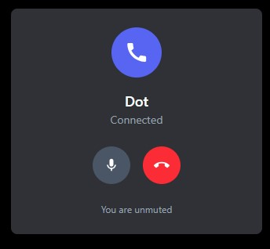

# Xelyra 🚀

> **The Next-Generation Communication Platform** - A modern, Discord-inspired chat application with cutting-edge AI integration, real-time messaging, and an extensible bot SDK.


_Welcome to Xelyra: Modern, sleek, and built for the future of communication._

## 🌟 **Revolutionary Features**

### 🤖 **AI-Powered Personal Assistant (Xyn)**

Meet **Xyn**, your intelligent AI companion integrated directly into Xelyra. Xyn can:

- **Generate AI profile pictures** from text descriptions
- **Automatically update account details** through natural conversation
- **Create custom images** on demand
- **Provide contextual assistance** across the platform


_Meet Xyn: Your friendly, always-available AI assistant in Xelyra._

**AI-Generated Profile Pictures:**


_Watch as Xyn generates a unique profile picture for you using AI, based on your description!_

**File-Based Profile Updates:**


_Easily update your profile picture by uploading an image file—Xyn handles the rest._

**Natural Language Account Management:**


_Change your display name and other details just by chatting with Xyn—no forms required!_

**Dedicated AI Chat Interface:**


_Dedicated AI assistant chat window with natural language processing capabilities._

### 🔧 **Advanced Bot SDK & Developer Tools**

**Developer Portal:**


_Powerful developer dashboard for managing your applications, bots, and integrations._

**Application Management:**


_Comprehensive application management with overview, bot configuration, and settings._

**SDK Documentation & Examples:**


_In-depth, interactive SDK documentation to help you build bots and integrations quickly._

**Rich Message Formats & Embeds:**


_Send messages with rich embeds, formatting, and media for a dynamic chat experience._

**Advanced Bot Interactions:**


_Advanced bot interactions with rich embeds, buttons, and dynamic responses._


_Support for primary, secondary, and destructive button types in bot interactions._

#### **🚀 Xelyra Bot SDK - The Most Advanced Bot Framework**

Our SDK is designed for maximum extensibility and ease of use:

```typescript
import { XelyraClient } from "xelyra-bot-sdk";

const bot = new XelyraClient({
  token: "YOUR_BOT_TOKEN",
  gatewayUrl: "http://localhost:3000/bot",
});

// Register slash commands with descriptions and options
bot.command(
  "weather",
  async (ctx) => {
    const city = ctx.args.city || "New York";
    const weather = await getWeather(city);
    await ctx.send(`Weather in ${city}: ${weather.temperature}°C`);
  },
  [{ name: "city", type: "string", description: "City name", required: false }],
  "Get weather information for a city"
);

// Advanced message manipulation
bot.command("poll", async (ctx) => {
  const message = await ctx.send("React to vote!", [
    {
      title: "Community Poll",
      description: "What feature should we add next?",
      fields: [
        { name: "🎮", value: "Gaming integration", inline: true },
        { name: "🎵", value: "Music bots", inline: true },
        { name: "📊", value: "Analytics dashboard", inline: true },
      ],
    },
  ]);

  // Edit messages dynamically
  setTimeout(async () => {
    await bot.editMessage(message.id, "Poll closed!", [
      {
        title: "Final Results",
        description: "Gaming integration wins!",
      },
    ]);
  }, 60000);
});

bot.login();
```

**Key SDK Features:**

- **Real-time WebSocket communication** with automatic reconnection
- **Slash command registration** with validation and auto-completion
- **Rich embed support** with customizable fields, colors, and formatting
- **Message editing and deletion** with full CRUD operations
- **Event-driven architecture** for responsive bot interactions
- **TypeScript support** with full type safety
- **Modular design** for easy extension and customization

### 🔐 **Enterprise-Grade Authentication System**

**Secure OTP Verification:**

- **Email-based OTP** with 6-digit codes
- **JWT token authentication** with secure cookie storage
- **Password hashing** using bcrypt with salt rounds
- **Session management** with automatic token refresh
- **CSRF protection** with secure cookie policies

**Authentication Flow:**

1. **User Registration** → Email validation → OTP generation → Account creation
2. **Secure Login** → Password verification → JWT token issuance → Session establishment
3. **Token Validation** → Automatic session renewal → Secure logout

### ⚡ **Real-Time Communication Engine**

**WebSocket-Powered Messaging:**

- **Instant message delivery** with sub-second latency
- **Redis-backed scaling** for multi-server deployments
- **Room-based broadcasting** for efficient message routing
- **Connection state management** with automatic reconnection
- **Typing indicators** and presence detection

**Advanced Features:**

- **Infinite scroll** with efficient pagination
- **Message editing and deletion** with real-time updates
- **File uploads** with progress tracking
- **Reply threading** with context preservation
- **Message reactions** and interactive elements

### 👤 **User Experience & Communication Features**

**Profile Management:**


_Comprehensive user profile settings with display name, username, and password management._

**Media & Communication:**


_Seamless GIF integration with Tenor for expressive communication._



_Crystal-clear voice calling with intuitive controls and status indicators._

### 🏗️ **Scalable Architecture**

**Backend Stack:**

- **NestJS** - Enterprise-grade Node.js framework
- **ScyllaDB/Cassandra** - High-performance NoSQL database
- **Redis** - In-memory caching and session storage
- **Socket.IO** - Real-time WebSocket communication
- **Google Gemini AI** - Advanced AI integration

**Frontend Stack:**

- **React 19** - Latest React with concurrent features
- **TypeScript** - Type-safe development
- **Tailwind CSS** - Utility-first styling
- **Vite** - Lightning-fast build tool
- **GSAP** - Smooth animations and transitions

### 🎮 **Server Management & Social Features**

**Server Creation & Overview:**


_Create new servers in seconds—customize everything from the name to the icon._


_Complete server experience with channels, members, and real-time communication._

**Server Administration:**


_Comprehensive server settings with overview, roles, members, and application management._

**Member Management:**


_Advanced member management with role assignment, kicking, and banning capabilities._

**Role System:**


_Flexible role system with custom permissions and role management._

**Invite System:**


_Invite friends directly or share server invite links with expiration tracking._


_Server invitation cards with join buttons for new members._


_Invitation confirmation showing successful server joins._

**Friend System:**


_Add friends and grow your network with a simple, intuitive interface._

**Advanced Features:**

- **Role AND channels based permissions** with granular control
- **Channel categories** for organized communication
- **Server member management** with invite systems
- **File sharing** with support for multiple formats
- **Voice channel support** (coming soon)

## 📊 Automated Load Testing & System Benchmarks

To ensure Xelyra's backend and frontend can handle real-world scale, we conducted extensive automated load testing and system monitoring. Here’s what we did:

### What We Automated

- **Simulated ~500 users**: Automated account creation, login, friend requests, group/server/DM creation, and app/bot registration.
- **Massive message load**: Used custom scripts to send messages, reaching up to **3 million messages** in the database.
- **Full workflow automation**: Users performed all major actions—creating apps, servers, groups, DMs, sending/accepting friend requests, and logging in—mirroring real user behavior.
- **SDK and load-testing scripts**: All automation was performed using our SDK and dedicated load-testing scripts.

### Test Environment

- **Hardware**: Intel i5 3rd Gen CPU
- **Order of tests**:
  1. Event loop monitoring
  2. CPU and memory usage
  3. Open file descriptors

### System Monitoring Results

#### 1. Event Loop Latency


_Tracks Node.js event loop lag under heavy load._

#### 2. CPU and Memory Usage


_Resource consumption during peak automation on an Intel i5 3rd Gen._

#### 3. Open File Descriptors


_Monitors the number of open files/sockets during stress tests._

## 🚀 **Getting Started**

### **Prerequisites**

- Node.js 18+
- ScyllaDB/Cassandra
- Redis
- Google Gemini API key

### **Required Environment Variables**

Create a `.env` file in the `backend` directory with the following variables:

```env
# JWT secret for authentication
JWT_SECRET=your_jwt_secret

# Gmail credentials for OTP/email
GMAIL=your_gmail_address
GMAIL_PASS=your_gmail_app_password

# Google Gemini API key for AI features
GEMINI_API_KEY=your_gemini_api_key

# AI_ID must be set to this value for the app to function correctly
AI_ID=117cd972-3760-47b9-9c38-e6bbc28196f5
```

### **1. Backend Setup**

```bash
cd backend
npm install

# Setup env variables, Scylla db and Redis

# Start development server
npm run start:dev
```

### **2. Frontend Setup**

```bash
cd frontend
npm install
npm run dev
```

### **3. Bot SDK Setup**

```bash
cd xelyra-bot-sdk
npm install

```

### **4. Database Initialization**

Run the CQL scripts in order:

```bash
# Execute scripts from backend/src/db/cql_scripts/
# 001_create_keyspace.cql
# 002_create_users.cql
# ... (all scripts in numerical order)
```

## 🔧 **Development & Architecture**

## 🗄️ **Database Schema Overview**

Below is a comprehensive entity-relationship diagram of the Xelyra database schema, showing how all major entities (users, servers, channels, roles, messaging, bots, applications, etc.) are interconnected. The diagram illustrates the complex relationships and data flow throughout the platform:


_This updated schema diagram shows the complete data architecture of Xelyra, including user management, server administration, messaging systems, bot integrations, and application management. The relationships demonstrate how data flows between different components, from user authentication to real-time messaging and bot interactions._

### **Project Structure**

```
Xelyra/
├── backend/                 # NestJS API & WebSocket Gateway
│   ├── src/
│   │   ├── controllers/     # API endpoints
│   │   ├── logic/          # Business logic (flat, modular)
│   │   ├── services/       # Database operations
│   │   ├── gateways/       # WebSocket handlers
│   │   └── db/            # ScyllaDB integration
├── frontend/               # React + TypeScript + Tailwind
│   ├── src/
│   │   ├── components/     # Modular React components
│   │   ├── assets/         # Images, GIFs, icons
└── xelyra-bot-sdk/         # Extensible Bot SDK
    ├── src/
    │   ├── client.ts       # Main SDK client
    │   ├── structures/     # Data structures
    │   └── types.ts        # TypeScript definitions
```

### **Key Design Principles**

- **Flat Logic Architecture** - No nested if/else, modular functions
- **Separation of Concerns** - Controllers, logic, and services are distinct
- **Type Safety** - Full TypeScript coverage across the stack
- **Real-time First** - WebSocket-driven architecture
- **AI Integration** - Seamless AI features throughout the platform

## 🌟 **Innovation Highlights**

### **AI-First Design**

- **Natural language processing** for account management
- **AI-generated content** (images, responses)
- **Contextual assistance** across all features
- **Intelligent automation** for repetitive tasks

### **Developer Experience**

- **Comprehensive SDK** with full TypeScript support
- **Real-time development** with hot reloading
- **Extensive documentation** with examples
- **Modular architecture** for easy extension

### **Performance & Scalability**

- **ScyllaDB** for high-throughput data storage
- **Redis** for caching and session management
- **WebSocket clustering** for horizontal scaling
- **Optimized queries** with proper indexing

### **Development Setup**

1. Fork the repository
2. Create a feature branch
3. Make your changes
4. Add tests if applicable
5. Submit a pull request

## 📄 **License**

This project is licensed under the MIT License - see the [LICENSE](LICENSE) file for details.

---

**Built with ❤️ using cutting-edge technologies for the future of communication.**

## 🔗 API Endpoints

Below is a summary of the main backend API endpoints exposed by Xelyra. These endpoints power all major user actions in the frontend (via axios/fetch), including authentication, messaging, server/group management, developer features, and more.

| Endpoint (Path)                                                 | Method | Description                         |
| --------------------------------------------------------------- | ------ | ----------------------------------- |
| `/signup`                                                       | POST   | Register a new user                 |
| `/signup/otp`                                                   | POST   | Request OTP for signup              |
| `/signup/auth`                                                  | POST   | Authenticate signup OTP             |
| `/login`                                                        | POST   | User login                          |
| `/login/auth`                                                   | POST   | Authenticate login                  |
| `/home/auth`                                                    | POST   | Home authentication                 |
| `/home/friends`                                                 | POST   | Fetch friends list                  |
| `/home/conversations`                                           | POST   | Fetch conversations                 |
| `/home/servers`                                                 | POST   | Fetch servers                       |
| `/home/dm`                                                      | POST   | Create DM                           |
| `/home/recieverInfo`                                            | POST   | Get receiver info                   |
| `/home/messages`                                                | POST   | Fetch messages                      |
| `/home/messages/send`                                           | POST   | Send message                        |
| `/home/messages/edit`                                           | POST   | Edit message                        |
| `/home/messages/delete`                                         | POST   | Delete message                      |
| `/home/senderInfo`                                              | POST   | Get sender info                     |
| `/home/groups/create`                                           | POST   | Create group                        |
| `/home/groups/fetch/info`                                       | POST   | Fetch group info                    |
| `/home/groups/add`                                              | POST   | Add to group                        |
| `/home/groups/kick`                                             | POST   | Kick from group                     |
| `/home/groups/leave`                                            | POST   | Leave group                         |
| `/home/groups/participants`                                     | POST   | List group participants             |
| `/home/servers/create`                                          | POST   | Create server                       |
| `/home/pfp`                                                     | POST   | Update profile picture              |
| `/home/groups/pfp`                                              | POST   | Update group picture                |
| `/home/groups/name`                                             | POST   | Change group name                   |
| `/home/requests`                                                | POST   | Fetch friend requests               |
| `/home/requests/send`                                           | POST   | Send friend request                 |
| `/home/requests/accept`                                         | POST   | Accept friend request               |
| `/home/requests/reject`                                         | POST   | Reject friend request               |
| `/home/requests/cancel`                                         | POST   | Cancel friend request               |
| `/home/requests/sent`                                           | POST   | Fetch sent requests                 |
| `/home/popupInfo`                                               | POST   | Fetch popup info                    |
| `/home/user/changeDisplayName`                                  | POST   | Change user display name            |
| `/home/user/changeBio`                                          | POST   | Change user bio                     |
| `/home/user/changeBannerTheme`                                  | POST   | Change user banner and theme colors |
| `/home/user/changeUsername`                                     | POST   | Change user username                |
| `/home/user/changePassword`                                     | POST   | Change user password                |
| `/servers/:id`                                                  | POST   | Fetch server info                   |
| `/servers/:id/channels`                                         | POST   | List channels in server             |
| `/servers/:id/category/create`                                  | POST   | Create category                     |
| `/servers/:id/channels/create`                                  | POST   | Create channel                      |
| `/servers/:id/roles/create`                                     | POST   | Create role                         |
| `/servers/:id/roles/fetch`                                      | POST   | Fetch roles                         |
| `/servers/:id/roles/assign`                                     | POST   | Assign role                         |
| `/servers/:id/roles/remove`                                     | POST   | Remove role                         |
| `/servers/:id/channels/:channel/permissions/assign`             | POST   | Assign channel permissions          |
| `/servers/:id/channels/:channel/permissions/new`                | POST   | Assign new channel permission       |
| `/servers/:id/channels/:channel/settings/fetch`                 | POST   | Fetch channel settings              |
| `/servers/:id/add`                                              | POST   | Add to server                       |
| `/servers/:id/roles/rename`                                     | POST   | Rename role                         |
| `/servers/:id/roles/color`                                      | POST   | Change role color                   |
| `/servers/:id/roles/permissions`                                | POST   | Update role permissions             |
| `/servers/:id/update`                                           | POST   | Update server info                  |
| `/servers/:id/pfp`                                              | POST   | Update server picture               |
| `/developer/auth`                                               | POST   | Developer authentication            |
| `/developer/applications/create`                                | POST   | Create application                  |
| `/developer/applications/fetch`                                 | POST   | Fetch applications                  |
| `/developer/applications/:id/fetch/overview`                    | POST   | Fetch app overview                  |
| `/developer/applications/:id/fetch/bot`                         | POST   | Fetch app bot                       |
| `/developer/applications/:id/auth`                              | POST   | App authentication                  |
| `/developer/applications/:id/update/overview`                   | POST   | Update app overview                 |
| `/developer/applications/:id/bots/create`                       | POST   | Create bot                          |
| `/developer/applications/:id/bots/fetchToken`                   | POST   | Fetch bot token                     |
| `/developer/applications/:id/commands/create`                   | POST   | Create command                      |
| `/developer/applications/:id/commands/dispatch`                 | POST   | Dispatch command                    |
| `/developer/applications/:id/add/:server`                       | POST   | Add app to server                   |
| `/developer/servers/:id/`                                       | POST   | Developer server endpoint           |
| `/developer/commands/:id/conversation/:conversation/fetch/info` | POST   | Fetch command info                  |
| `/developer/applications/:id/update/pfp`                        | POST   | Update app picture                  |
| `/servers/:id/leave`                                            | POST   | Leave server                        |
| `/servers/:id/invites/create`                                   | POST   | Create server invite                |
| `/servers/:id/invites/find`                                     | POST   | Find server invite                  |
| `/servers/:id/members/fetch`                                    | POST   | Fetch server members                |
| `/servers/:id/members/kick`                                     | POST   | Kick member from server             |
| `/servers/:id/members/ban`                                      | POST   | Ban member from server              |
| `/servers/:id/members/unban`                                    | POST   | Unban member from server            |
| `/servers/:id/bans/fetch`                                       | POST   | Fetch server bans                   |
| `/servers/:id/apps/fetch`                                       | POST   | Fetch server applications           |
| `/servers/:id/apps/kick`                                        | POST   | Kick app from server                |
| `/servers/:id/apps/ban`                                         | POST   | Ban app from server                 |
| `/servers/:id/apps/unban`                                       | POST   | Unban app from server               |
| `/servers/:id/apps/bans/fetch`                                  | POST   | Fetch server app bans               |
| `/home/api/tenor/:id`                                           | POST   | Fetch Tenor GIF by ID               |
| `/home/api/tenorsearch`                                         | POST   | Search Tenor GIFs                   |
| `/home/api/tenortrending`                                       | POST   | Fetch trending Tenor GIFs           |
| `/home/api/tenorcategories`                                     | POST   | Fetch Tenor GIF categories          |
| `/home/servers/invites/fetch`                                   | POST   | Fetch server invites                |
| `/home/servers/permissionToAdd`                                 | POST   | Check permission to add to server   |
| `/genai/message`                                                | POST   | Send message to GenAI               |
| `/metrics`                                                      | GET    | Fetch metrics                       |

_The frontend calls these endpoints using axios from React components to power all user and developer features._
